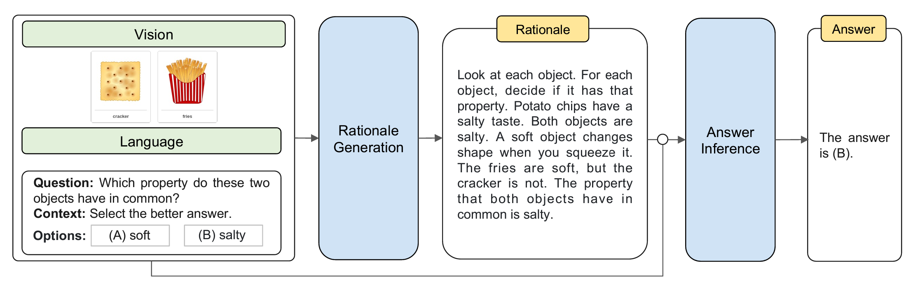

# Multimodal Chain-of-Thought Reasoning in Language Models

## Chain-of-Thought, explained in one sentence
Multimodal Chain-of-Thought refers to Model providing rationale in addition to giving answer to a question and visual.

### Why does it matter?
It helps building explainable, trustworthy AI.

## What is this paper about?
The paper introduced a **mini-model (less than 1B parameter) combining textual transformer and visual transformer** that provide rationale and solution to a given question that **yields 20% better performance than 175B GPT 3.5 model**.

Essentially, you provide the question, and an image demonstrating the problem, it will provide answer, and rationale to the answer.

## What was the status quo before this paper? What is the innovative idea here?
Chain of Thought (CoT) reason was more on language transformers, with minimal consideration for multimodal scenarios that involve both language (text) and vision (images). 

Usually model deducing rationale only happens with larger models, models smaller than 100B parameters tend to produce illogical rationale. Having a mini model that yields better performance than large models is very rare. 

## Dataset
ScienceQA dataset is a comprehensive resource aimed at **enhancing the capabilities of AI in understanding and answering questions related to science.** 

- Contains thousands of questions covering a broad spectrum of scientific knowledge.
- Multiple-choice, true/false and open-ended questions to test different aspects of scientific reasoning and understanding.
- Some versions of the ScienceQA dataset incorporate visual elements, such as diagrams and illustrations, to accompany questions and aid in visual reasoning tasks.
- Require models not just factual recall but also deeper levels of understanding, such as inference, application, and analysis based on scientific content.

## How does the algorithm work?

### Pseudocode

### Question: What is "gated fusion mechanism" (line 9)?
I = $\lambda \cdot H_{\text{language}} + (1 - \lambda) \cdot H_{\text{vision-attn}}$

## Demonstration/Rant
Refer to Jupyter Notebook. Conducted heavy source-code modification.
#### Rationale Generated by model:

#### Answer Generated by model:

## Relevant Resource
**I've created a Custom GPT to answer all your questions! https://chat.openai.com/g/g-GB3bSTH33-mm-cot-gpt**

Additionally, here are some other research worth taking a look at:
1. Attention Is All You Need:
Vaswani, A., Shazeer, N., Parmar, N., Uszkoreit, J., Jones, L., Gomez, A. N., Kaiser, L., and Polosukhin, I. "Attention is all you need." In Guyon, I., von Luxburg, U., Bengio, S., Wallach, H. M., Fergus, R., Vishwanathan, S. V. N., and Garnett, R. (eds.), Advances in Neural Information Processing Systems 30: Annual Conference on Neural Information Processing Systems 2017, December 4-9, 2017, Long Beach, CA, USA, pp. 5998–6008, 2017​​.

2. Deep Residual Learning for Image Recognition:
He, K., Zhang, X., Ren, S., and Sun, J. "Deep residual learning for image recognition." In 2016 IEEE Conference on Computer Vision and Pattern Recognition (CVPR), Las Vegas, NV, USA, June 27-30, 2016, pp. 770–778. IEEE Computer Society, 2016. doi: 10.1109/CVPR.2016.90​​.

3. An Image is Worth 16x16 Words: Transformers for Image Recognition at Scale:
Dosovitskiy, A., Beyer, L., Kolesnikov, A., Weissenborn, D., Zhai, X., Unterthiner, T., Dehghani, M., Minderer, M., Heigold, G., Gelly, S., et al. "An image is worth 16x16 words: Transformers for image recognition at scale." In The International Conference on Learning Representations (ICLR), 2021​​.

4. End-to-End Object Detection with Transformers:
Carion, N., Massa, F., Synnaeve, G., Usunier, N., Kirillov, A., and Zagoruyko, S. "End-to-end object detection with transformers." In Computer Vision–ECCV 2020: 16th European Conference, Glasgow, UK, August 23–28, 2020, Proceedings, Part I, pp. 213–229, 2020​​.

5. Big Self-Supervised Models are Strong Semi-Supervised Learners:
Chen, T., Kornblith, S., Norouzi, M., and Hinton, G. E. "Big self-supervised models are strong semi-supervised learners." In Larochelle, H., Ranzato, M., Hadsell, R., Balcan, M. F., and Lin, H. (eds.), Advances in Neural Information Processing Systems 33: Annual Conference on Neural Information Processing Systems 2020, NeurIPS 2020, December 6-12, 2020, virtual, 2020​​.

## Citation for this paper
Zhuosheng Zhang, Aston Zhang, Mu Li, Hai Zhao, George Karypis, Alex Smola. "Multimodal Chain-of-Thought Reasoning in Language Models." arXiv:2302.00923v4 [cs.CL], 17 Feb 2023​​.

